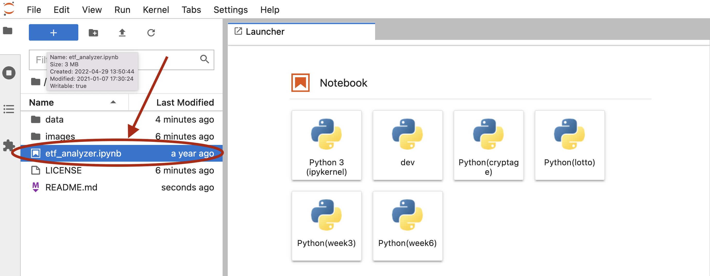

# ETFBuilder

ETFBuilder is a FinTech tool to design and build ETFs.

---

## Technologies

* **Pandas** - A Python library with advanced financial analysis tools.
* **Jupyter Lab** - An IDE used for visualization.
* **anaconda** - A Python framework consisting of several tools used in financial analysis, such as Pandas and Jupyter Lab.
* **hvplot** - A set of Python visualization tools used to create compelling, and interactive visualizations.  
* **SQLAlchemy** - An open-source SQL library for Python.
* **Voilà** - a Python library that converts a Jupyter notebook into a live webpage.

---

## Installation Guide

### Prerequisites

The following are required to use this analytical notebook
* Python 3.7+
* Anaconda
* Jupyter Lab
* Pandas
* SQLAlchemy
For instructions on how to install these and how to run Jupyter Lab, please refer to *Installation Guide* found at [Cryptage](https://github.com/CAMPSMITH/cryptage.git)

### Voilà

To install Voilà, activate your conda environment and run the following command

```
conda install -c conda-forge voila
```

---

## Usage

### Running the RentalInsight Notebook

Once Jupyter Lab has started in your browser, select the *etf_analyzer.ipynb* notebook from the Left Sidebar.


### Web App

# ADD screenshots

---

## Contributors

*  **Martin Smith** <span>&nbsp;&nbsp;</span> |
<span>&nbsp;&nbsp;</span> *email:* msmith92663@gmail.com <span>&nbsp;&nbsp;</span>|
<span>&nbsp;&nbsp;</span> [](https://www.linkedin.com/in/smithmartinp/)

---

## License

[](LICENSE)