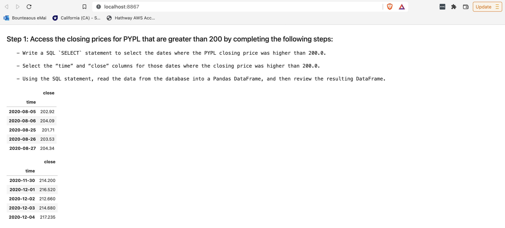
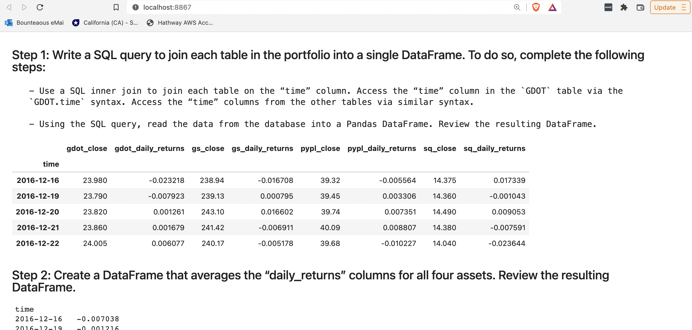

# ETFBuilder

ETFBuilder is a FinTech tool to design and build ETFs.

---

## Technologies

* **Pandas** - A Python library with advanced financial analysis tools.
* **Jupyter Lab** - An IDE used for visualization.
* **anaconda** - A Python framework consisting of several tools used in financial analysis, such as Pandas and Jupyter Lab.
* **hvplot** - A set of Python visualization tools used to create compelling, and interactive visualizations.  
* **SQLAlchemy** - An open-source SQL library for Python.
* **Voilà** - a Python library that converts a Jupyter notebook into a live webpage.

---

## Installation Guide

### Prerequisites

The following are required to use this analytical notebook
* Python 3.7+
* Anaconda
* Jupyter Lab
* Pandas
* SQLAlchemy
For instructions on how to install these and how to run Jupyter Lab, please refer to *Installation Guide* found at [Cryptage](https://github.com/CAMPSMITH/cryptage.git)

### Voilà

To install Voilà, activate your conda environment and run the following command

```
conda install -c conda-forge voila
```

---

## Usage

### Running the RentalInsight Notebook

Once Jupyter Lab has started in your browser, select the *etf_analyzer.ipynb* notebook from the Left Sidebar.


### Running the ETFBuilder Notebook as a WebApp
To help distribute the information, **voilà** can be used to turn the analysis notebook into a webapp that others can easily access.  To start the webapp, ensure that voilà is installed according to the above instructions and issue the following command:
```
voila etf_analyzer.ipynb
```
A web page should be started automatically to the web app. In addition, voila will output a message similar to the following:
```
[Voila] Voilà is running at:
http://localhost:8867/
```

#### Sharing the ETF Builder WebApp
To share the web app with others, simply share the webapp url.  Simply replace *localhost* with the IP address of your maching:
```
http://<IP address of machine running voila>:8867/
```
Note: The port may vary.  Replace *8867* with the port number indicated by the *Voilà is running at* message.

## ETFBuilder WebApp in Action
Once you have the web app running, 
### Initial WebApp View

### Confirm ETF Database Tables Were Created

### Exploring PYPL
The webapp shares an analysis of PYPL, one of the components of the ETF. Scroll down the page to view the following:
#### Viewing the PYPL data frame

#### PYPL Daily Returns Plot

#### PYPL Daily Returns Plot Interactive
The PYPL Daily Returns plot is interactive.  Controls on the righ can allow users to examine periods of interest, such as the period of high volatility shown in this screen shot.

#### PYPL Cumulative Return Plot

#### PYPL Cumulative Return Plot Interactive
The PYPL Cumulative Return plot is interactive.  Controls on the righ can allow users to examine periods of interest, such as the period of high growth shown in this screen shot.

#### Viewing PYPL close above 200

#### Viewing Top 10 PYPL daily return dates

### Analyzing the ETF
#### Consolidating ETF Portfolio Data into a Joined view

#### ETF Return Analysis
The following screen shot shows the ETF Portfolio's average daily return, Annualized Portfolio Return and final ETF Portfolio Cumulative Return.

#### ETF Portfolio Cumulative Return Plot

#### ETF Portfolio  Cumulative Return Plot Interactive
The ETF Portfolio Cumulative Return plot is interactive.  Controls on the righ can allow users to examine periods of interest, such as the period of high growth shown in this screen shot.


---

## Contributors

*  **Martin Smith** <span>&nbsp;&nbsp;</span> |
<span>&nbsp;&nbsp;</span> *email:* msmith92663@gmail.com <span>&nbsp;&nbsp;</span>|
<span>&nbsp;&nbsp;</span> [](https://www.linkedin.com/in/smithmartinp/)

---

## License

[](LICENSE)